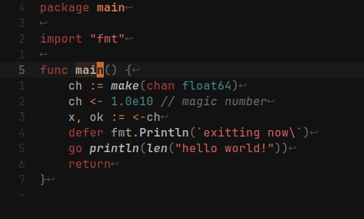

# Ashen Themes

<!--toc:start-->

- [Ashen Themes](#ashen-themes)
  - [Text Editors](#text-editors)
  - [Terminal Emulators](#terminal-emulators)
  - [CLI/TUI](#clitui)
  - [GUI](#gui)
  - [Format](#format)
- [Contributing](#contributing)

<!--toc:end-->

[Ashen](https://sr.ht/~ficd/ashen/) is a warm, muted theme featuring red,
orange, and plenty of gray. It's designed to be easy on the eyes, well-suited to
programming in the dark, and evoke a sense of comfort and warmth. Inspirations
are Dark Souls 3 and
[nvim-noirbuddy](https://github.com/jesseleite/nvim-noirbuddy).

This monorepository contains implementations of Ashen for a variety of
applications. It's hosted on [sourcehut](https://sr.ht/~ficd/ashen/) and
mirrored on [GitHub](https://github.com/ficcdaf/ashen) for users' convenience.
Please submit issues to the [ticket tracker](https://todo.sr.ht/~ficd/ashen) or
contact the [mailing list](https://lists.sr.ht/~ficd/ashen).

## Text Editors

- [Helix](./helix/README.md)
- [Neovim](https://git.sr.ht/~ficd/ashen.nvim)

## Terminal Emulators

- [Ghostty](./ghostty)
- [Kitty](./kitty)
- [Alacritty](./alacritty)
- [Windows Terminal](./windows-terminal/README.md)
- [WezTerm](./wezterm/README.md)
- [foot](./foot/README.md)

## CLI/TUI

- [bat](./bat/README.md)
- [eza](./eza/README.md)
- [lazygit](./lazygit/README.md)
- [yazi](./ashen.yazi/README.md)
- [fzf](./fzf/README.md)
- [fish](./fish/README.md)
- [television](./television/README.md)
- [aerc](./aerc/README.md)

## GUI

- [waybar](./waybar/README.md)
- [sway](./sway/README.md)
- [fuzzel](./fuzzel/README.md)
- [zathura](./zathura/README.md)
- [Firefox](./firefox/README.md)
- [Monkeytype](./monkeytype/README.md)

## Format

- [tmTheme](./tmtheme/README.md)

# Contributing

I welcome contributions! If you have a problem or a request, please submit a
ticket or contact the mailing list. Send patches to
[~ficd/ashen-devel](https://lists.sr.ht/~ficd/ashen-devel).

If you're porting Ashen, use the existing ports as a reference for the palette
and overall feel. Treat [Helix](/helix/README.md) as the "ultimate" guide on the
colors to be assigned to syntax elements.

As a rule of thumb: numbers and builtin literal types should be `blue`, strings
`red_glowing`, keywords `red_ashen`, operators `orange_blaze`, delimiters
`orange_smolder`, brackets `g_6`, and special punctuation `orange_golden`.
`red_flame` should _only_ be used for errors, and `orange_golden` is the
preferred color for warnings. Ashen doesn't use green, so you can pick an
appropriate substitute from the palette. For example, the terminal themes use
`orange_blaze` for green, which looks good in most applications.
