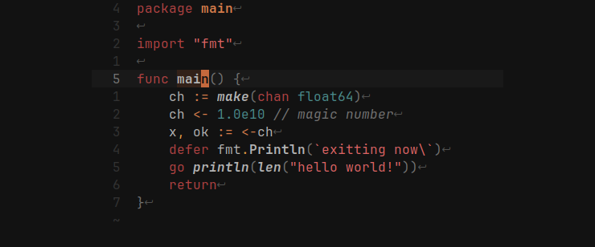
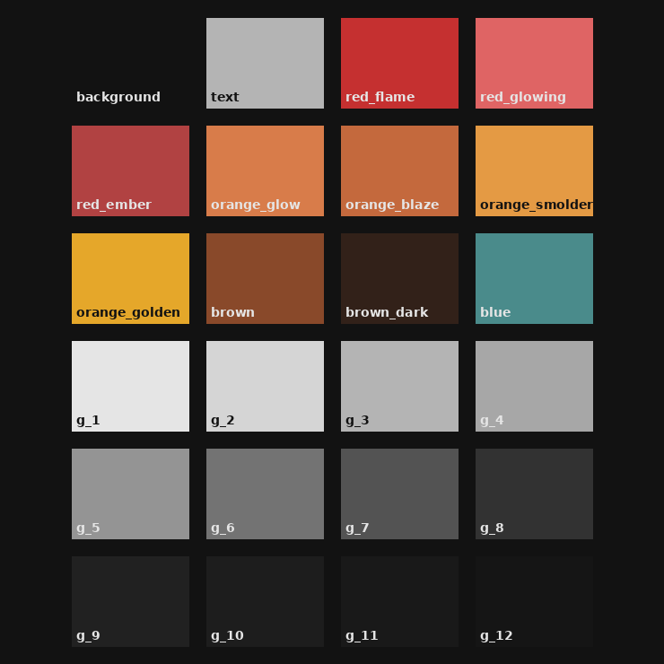

# Ashen

> _**Let the fire fade — not your focus**._
>
> _Designed for long nights and longer thoughts._

[Ashen](https://codeberg.org/ficd/ashen) is a warm, muted theme born from the
glow of dying embers — rich in reds, orange highlights, and layers of gray.
Inspired by _Dark Souls III_, it's crafted to be gentle on the eyes and steady
on the mind. Whether you're deep in the terminal or writing code by candlelight,
Ashen offers a calm, focused atmosphere for development after dark.

This monorepository contains official implementations of Ashen across a range of
editors, terminals, tools, and more. Each is carefully tuned to carry the same
muted warmth. The project is developed on
[Codeberg](https://codeberg.org/ficd/ashen) and provides a read-only mirror on
[GitHub](https://github.com/ficd0/ashen). Please see
[Contributing](#contributing) to learn how to contribute to Ashen.

> [!NOTE]
> The GitHub mirror will likely be deleted in the near future.

<!--toc:start-->

- [Ashen](#ashen)
  - [Text Editors](#text-editors)
  - [Terminals](#terminals)
  - [Tools & Interfaces](#tools-interfaces)
  - [Desktop & UI](#desktop-ui)
  - [Theme Formats](#theme-formats)
  - [Contributing](#contributing)
    - [Porting Ashen](#porting-ashen)

<!--toc:end-->

## Text Editors

- [Helix](./helix/README.md)
- [Kakoune](https://codeberg.org/ficd/kak-ashen)
- [Neovim](https://codeberg.org/ficd/ashen.nvim)

## Terminals

- [Alacritty](./alacritty/README.md)
- [foot](./foot/README.md)
- [Ghostty](./ghostty/README.md)
- [Kitty](./kitty/README.md)
- [WezTerm](./wezterm/README.md)
- [Windows Terminal](./windows-terminal/README.md)

## Tools & Interfaces

- [aerc](./aerc/README.md)
- [bat](./bat/README.md)
- [eza](./eza/README.md)
- [fish](./fish/README.md)
- [fzf](./fzf/README.md)
- [lazygit](./lazygit/README.md)
- [television](./television/README.md)
- [yazi](./ashen.yazi/README.md)
- [zellij](./zellij/README.md)
- [zsh](./zsh)

## Desktop & UI

- [Firefox](./firefox/README.md)
- [fuzzel](./fuzzel/README.md)
- [Monkeytype](./monkeytype/README.md)
- [sway](./sway/README.md)
- [waybar](./waybar/README.md)
- [zathura](./zathura/README.md)

## Theme Formats

- [Base16](./base16/README.md)
- [Pygments](./pygments/README.md)
- [tmTheme](./tmtheme/README.md)

## Contributing

### Guidelines

I do not accept PRs on GitHub! Please contribute on
[Codeberg](https://codeberg.org/ficd/ashen). I also accept contributions via
`git-send-mail`, please send patches to `daniel <AT> ficd <DOT> sh`.

Make sure your contribution adheres to the existing structure of the repository.
For example, if you're adding a new port, the subdirectory should contain a
`README.md` with installation instructions, and an appropriate link should be
added the main `README`.

Please add yourself to the [`AUTHORS`](./AUTHORS) file when you're done. Don't
list individual commits; summarize your contribution succinctly. Also note that
the primary authors retain the right to deny any changes if they don't fit with
our vision for Ashen.

### Porting Ashen

If you're porting Ashen, use the existing ports as a reference for the palette
and overall feel. Treat [Kakoune](./kakoune/) as the "ultimate" guide on the
colors to be assigned to syntax elements.

As a rule of thumb: numbers and builtin literal types should be `blue`, strings
`red_glowing`, keywords `red_ashen`, operators `orange_blaze`, delimiters
`orange_smolder`, brackets `g_6`, and special punctuation `orange_golden`.
`red_flame` should _only_ be used for errors, and `orange_golden` is the
preferred color for warnings. Ashen doesn't use green, so you can pick an
appropriate substitute from the palette. For example, the terminal themes use
`orange_blaze` for green, which looks good in most applications.
