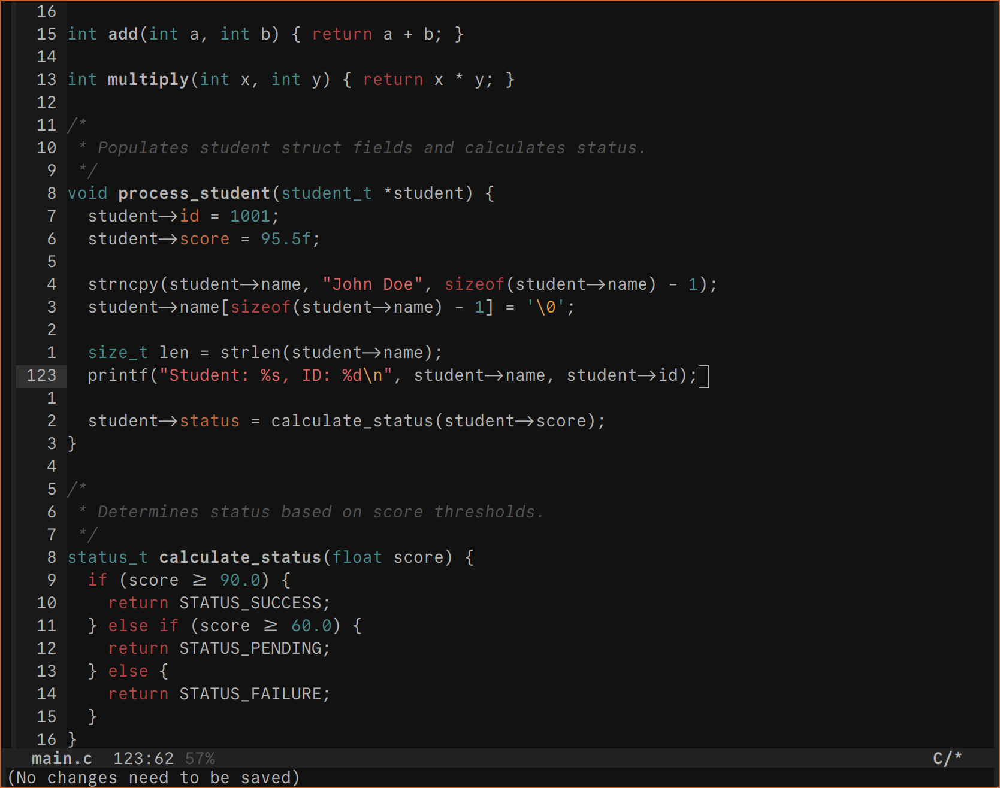

 # Ashen for Emacs

This directory contains the Emacs port of the [Ashen](https://codeberg.org/ficd/ashen/) colorscheme.



> [!Note]  
> The theme is named `ashen` and the file is named `ashen-theme.el` as per Emacs' `name-theme.el` convention.

<!--toc:start-->
- [Features](#features)
- [Installation](#installation)
  - [package-vc-install](#package-vc-install)
  - [use-package](#use-package)
  - [Elpaca](#elpaca)
  - [straight.el](#straightel)
  - [Manual](#manual)
- [Usage](#usage)
  - [hl-todo](#hl-todo)
- [Extras](#extras)
<!--toc:end-->

## Features

- Targets common Emacs faces (Font Lock, mode line, minibuffer, etc.).
- Tree-sitter face support where available.

## Installation

### package-vc-install

> [!IMPORTANT]  
> Requires Emacs 29+

```elisp
(package-vc-install
    '(ashen-theme
        :url "https://codeberg.org/ficd/ashen"
        :lisp-dir "emacs"
            :main-file "ashen-theme.el"))

(load-theme 'ashen t)
```

### use-package

> [!IMPORTANT]  
> Requires Emacs 30+

```elisp
(use-package ashen-theme
    :vc (:url "https://codeberg.org/ficd/ashen"
         :lisp-dir "emacs"
         :main-file "ashen-theme.el"
         :rev :newest)
     :init
  (load-theme 'ashen t))
```

### Elpaca

```elisp
(elpaca
    (ashen-theme
        :repo  "https://codeberg.org/ficd/ashen.git"
        :files ("emacs/ashen-theme.el")
        :main  "ashen-theme.el")
    ;; Make the built package dir a theme dir, then load the theme
    (add-to-list 'custom-theme-load-path
        (expand-file-name "ashen-theme/" elpaca-builds-directory))
    (load-theme 'ashen t))
```

### straight.el

```elisp
(straight-use-package
    '(ashen-theme :type git :host codeberg :repo "ficd/ashen"
        :files ("emacs/ashen-theme.el")))

;; straight builds packages under straight-build-dir; add it to theme search path
(add-to-list 'custom-theme-load-path
    (expand-file-name "ashen-theme/" straight-build-dir))

(load-theme 'ashen t)
```

### Manual Install

1. Clone the repo.
2. Copy `ashen-theme.el` to your Emacs `themes` directory (e.g. `~/.emacs.d/themes`).

```bash
git clone https://codeberg.org/ficd/ashen.git
cd ashen
cp ./emacs/ashen-theme.el ~/.emacs.d/themes
```

3. Add that directory to `custom-theme-load-path`:

```elisp
(add-to-list 'custom-theme-load-path
    (file-name-as-directory "~/.emacs.d/themes/ashen/"))

(load-theme 'ashen t)
```

## Usage

Enable Ashen:

- interactively: `M-x load-theme RET ashen RET`
- in config: `(load-theme 'ashen t)`

### hl-todo

If you use the `hl-todo` package, you can use something like the following config to match this theme:

```elisp
(use-package hl-todo
    :init
    (setq hl-todo-keyword-faces
        '(("TODO"  . "#c4693d")
        ("FIXME" . "#c53030")
        ("NOTE"  . "#a7a7a7")
        ("HACK"  . "#4a8b8b")
        ("WARN"  . "#e5a72a")))
    :config
    (global-hl-todo-mode 1))
```

## Extras

Ashen is available for many other programs. You can find them in the main repository on [Codeberg](https://codeberg.org/ficd/ashen).
